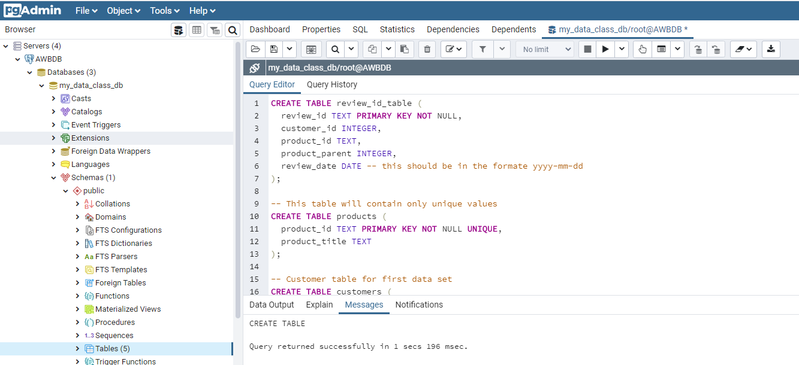
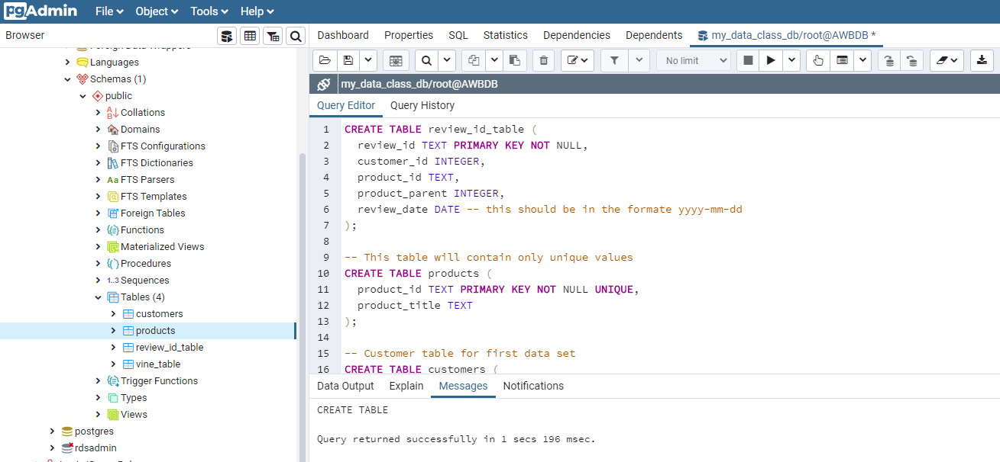
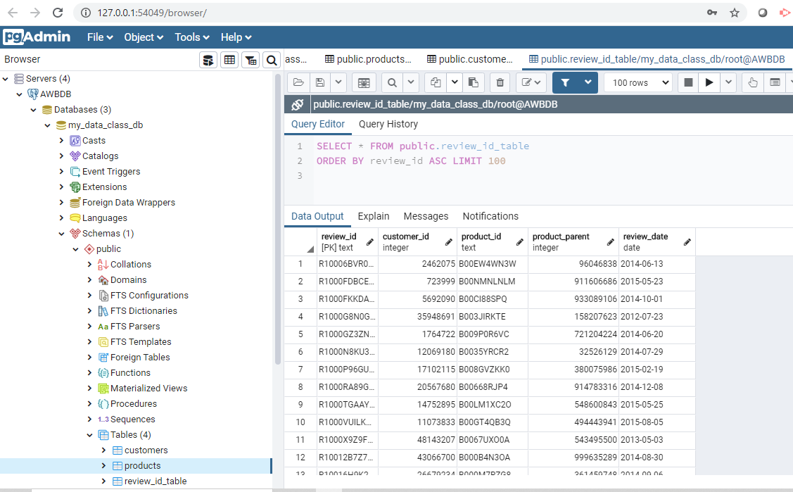
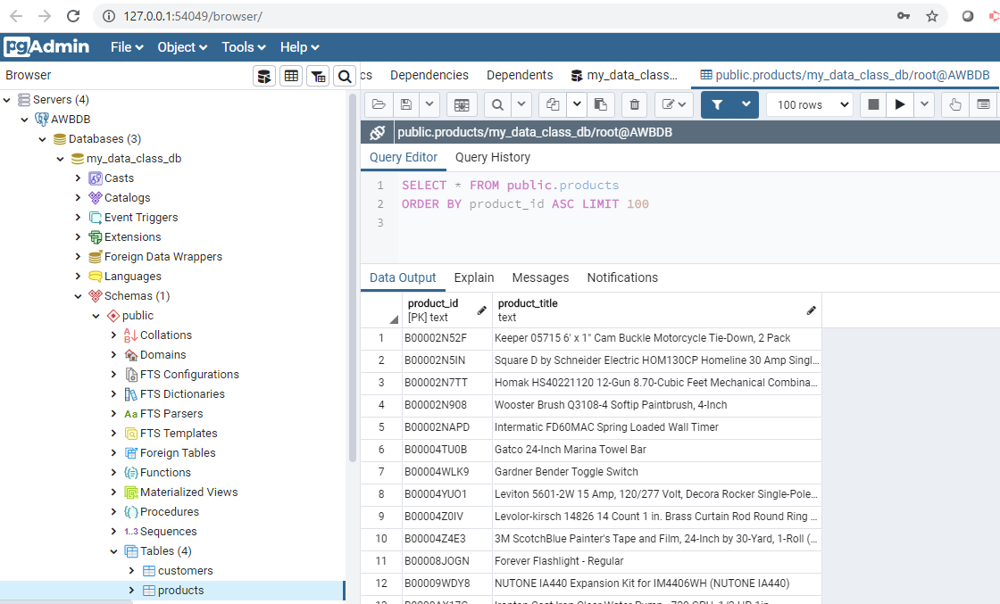
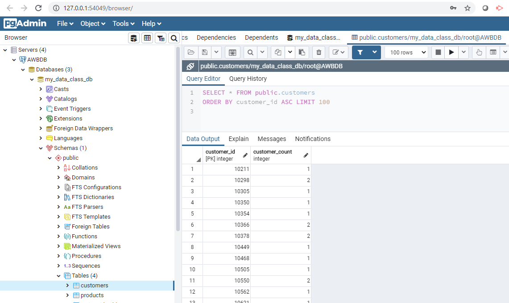
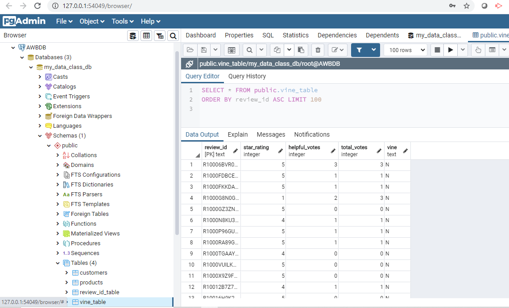

# Big Data Challenge: ETL and Analysis of Amazon products using AWS-RDS-PostgreSQL

Many of Amazon's shoppers depend on product reviews to make a purchase. [Amazon](https://s3.amazonaws.com/amazon-reviews-pds/tsv/index.txt) makes these review datasets publicly available. However, they are quite large and can exceed the capacity of local machines to handle. One dataset alone contains over 1.5 million rows; with over 40 datasets, this can be quite taxing on the average local computer. The first goal for this project was to perform the ETL process completely in the cloud and upload a DataFrame to an RDS instance. The second goal was to use PySpark to perform a statistical analysis of selected data to determine whether reviews from Amazon's Vine program are trustworthy. Ultimately, I determined that Vine reviews may not offer a complete picture of their reliability simply due to the sheer quantity of non-vine reviews to Vine reviews.

Please visit the [Amazon Vine Help Page](https://www.amazon.com/gp/vine/help?ie=UTF8) for additional information regarding the program.

## Technology Stack:

* AWS: RDS-PostgreSQL

* Google colab Notebook

* PySpark

### DB tables Creation in AWS: RDS-PostgreSQ:

### DB tables in AWS: RDS-PostgreSQ:

### DB tables population in AWS: RDS-PostgreSQ:

#### review_id_table db table:

#### product db table:

#### customers db table:

#### vine_table db table:

### Folder Structure:
   
#### level-1 (Folder)
- Google Colab Notebook: big_data_level_1.ipynb  
   
#### level-2 (Folder)
  
  * Google Colab Notebook: big_data_level_2.ipynb 

### Summary/Findings:
##### Verified ~ Unverified 
- Total verified purchases: 2,251,611
- Total unverified purchases: 305,394
% Ratio of unverified to verified purchases: 0.14%

##### At least 10 vote reviews:  
- There is very small percentage of products that meets this criteria 
- Percentage of products with 10 plus reviews:  0.049%

##### Paid Vine reviews
- There are roughly 45% of reviews are among paid vine reviews
- Paid Review count:  13,454
- Paid Five Star Review count:  6,006
- % of five-star reviews among Vine reviews 0.45%

##### Unpaid Vine reviews
- There are roughly 60% unpaid reviews among non Vine reviews 
- Unpaid Review count:  13,454
- Unpaid Five Star Review count:  6,006
- % of five-star unpaid reviews among non Vine reviews 0.60%